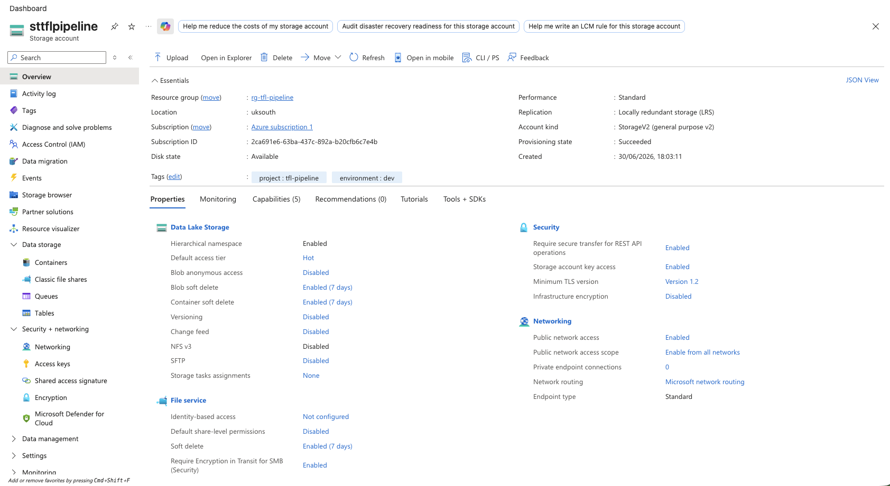
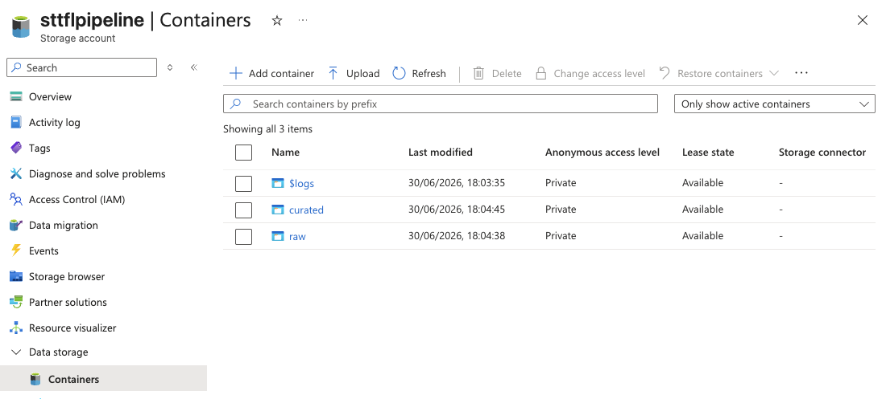
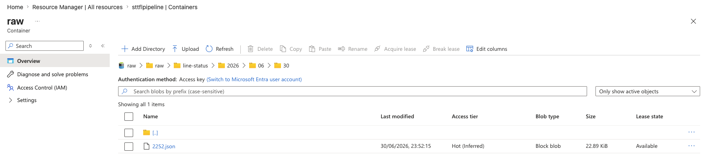

# TfL Network Status Pipeline

An Azure-native ELT pipeline that collects live network status data from the Transport for London (TfL) API, stores it in Azure Data Lake Storage Gen2, and loads it into Azure SQL Database for analysis. The pipeline answers a real operational question: which lines are disrupted, how severely, and how often?

I'm building this to get hands-on experience designing and deploying a cloud-native data pipeline from scratch using Azure data services. The focus is on applying engineering best practices throughout: raw zone as audit trail, fact vs dimension data modelled separately,
idempotent loads, and well-thought-out infrastructure decisions.

---

## Tech Stack

- Python 3.13
- Azure Data Lake Storage Gen2
- Azure Data Factory
- Azure SQL Database (Serverless)
- GitHub Actions
- pandas

---

## Data Sources

I'm pulling from two TfL Unified API endpoints, and I decided to treat them differently based on how frequently their data actually changes:

**Line Status** (`/Line/Mode/{modes}/Status`) — polled every 15 minutes via GitHub Actions cron. Returns the current status of every line across tube, DLR, Overground, and Elizabeth line. This is the fact data: it changes constantly and each poll is a new snapshot in time.

**StopPoint** (`/StopPoint/...`) — pulled once on setup and refreshed monthly. Returns static station reference data: names, zones, modes, coordinates. This is the dimension data: it rarely changes, so my instinct was to avoid polling it every 15 minutes since that would just be unnecessary API calls and wasted storage for no real benefit.

Treating the two sources differently based on their volatility was a deliberate design decision — it reflects how fact and dimension data behave differently in a real pipeline, not just what the data contains.

---

## Planned Architecture

Two Python collector scripts hit TfL API endpoints on a schedule, land the raw responses in ADLS Gen2, Azure Data Factory picks up and transforms the data, and the curated output is loaded into Azure SQL Database for querying.

```
TfL Line Status API (every 15 min)    TfL StopPoint API (monthly)
         |                                       |
   Python collector                        Python collector
   (light shaping)                         (light shaping)
         |                                       |
         └──────────────┬────────────────────────┘
                        |
              ADLS Gen2 — raw zone
              (untouched JSON, partitioned by date/hour)
              e.g. raw/line-status/2026/06/30/2252.json
                        |
              Azure Data Factory
              (flatten, join lines to affected stations)
                        |
              ADLS Gen2 — curated zone
              (Parquet, joined and cleaned)
                        |
              Azure SQL Database
              (serving layer, idempotent MERGE on load)
```

---

## Screenshots

### Storage Account — ADLS Gen2 configuration



Hierarchical namespace enabled (what makes this ADLS Gen2 rather than plain Blob Storage), LRS redundancy, tagged with project and environment.

### Containers



`raw` and `curated` containers created. `$logs` is auto-created by Azure for storage analytics.

### Raw Zone — First Successful Upload



Live TfL Line Status data landed in the raw zone at `raw/line-status/2026/06/30/2252.json`. Partitioned by date so files are navigable and sort chronologically.

---

## Design Decisions

**ELT over ETL** — the raw data lands in ADLS untouched before any transformation happens, rather than transforming before loading. This is the more modern cloud-native pattern and also means the raw zone acts as an audit trail. If the transform logic ever has a bug, I can reprocess from the original API response rather than trying to reverse-engineer what happened.

**LRS over GRS for storage redundancy** — Geo-redundant storage replicates data to a second Azure region, which roughly doubles storage cost. For a portfolio project handling public TfL data, I decided local redundancy (three copies within one datacentre) was more than sufficient.

**Account key authentication** — I'm using a storage account key for the ADLS connection to keep things simple at this stage. In production I'd replace this with Azure Managed Identity or a scoped service principal, since an account key grants full access to the storage account. This was a conscious tradeoff, not an oversight.

**Separate polling schedules per data source** — I decided to pull Line Status and StopPoint on different schedules because they have fundamentally different volatility. Polling static reference data every 15 minutes would just be wasted API calls and unnecessary storage growth.

---

## Project Plan

### Completed

- [x] Azure budget alerts and resource group
- [x] ADLS Gen2 storage account with `raw` and `curated` containers
- [x] Python project structure, venv and dependencies
- [x] `line_status.py` — fetch, transform and upload to ADLS raw zone
- [x] First successful upload confirmed in Azure Portal

### To Do

- [ ] `stoppoint.py`
- [ ] Structured logging
- [ ] GitHub Actions cron
- [ ] Azure SQL Database (Serverless)
- [ ] SQL schema and MERGE logic
- [ ] ADF pipeline
- [ ] Unit tests
- [ ] Final README review

### Stretch Goals

- [ ] Error handling and pipeline failure alerting
- [ ] Managed Identity authentication
